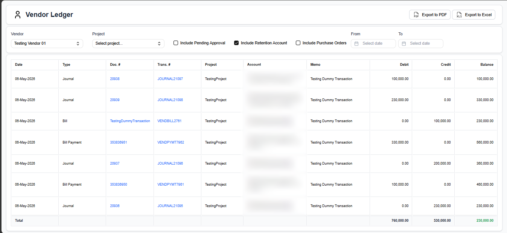
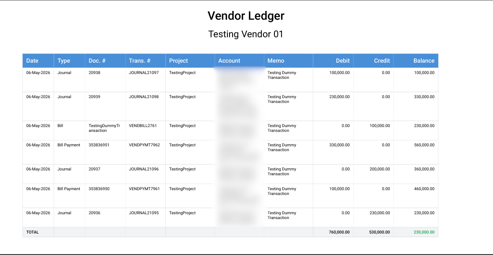
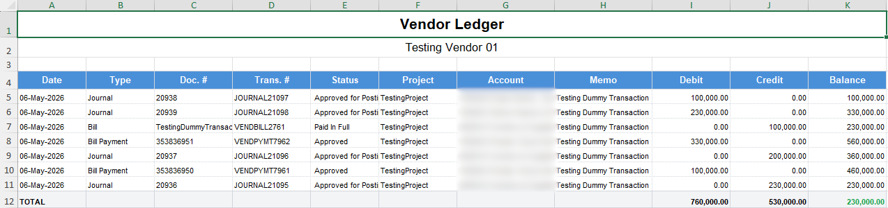

## Description:

The Vendor Ledger Report is a NetSuite-integrated financial report built to give a clear and detailed view of all transactions associated with each vendor. It displays credit entries, debit entries, and calculates a running final balance — making it easy to audit, reconcile, and track outstanding amounts at a glance.

The report is powered by a NetSuite RESTlet that queries live data using SuiteQL, while the frontend delivers a fast, responsive experience built with React and modern tooling.

## Tools & Technologies

| Tool | Purpose |
|------|---------|
| **React** (with TypeScript + Vite) | Frontend UI — builds the interactive ledger report interface |
| **Restlet + SuiteQL** | NetSuite backend script — queries vendor transaction data using SuiteQL and exposes it via a RESTlet endpoint |
| **TanStack Query (React Query)** | Handles all API data fetching, caching, and loading/error states for the ledger data |
| **Zustand** | Lightweight global state management — manages filters, selected vendor, and shared UI state |
| **shadcn/ui** | Provides the core UI components — tables, buttons, inputs, and dialogs used throughout the report |

## Preview

# Report

# PDF Preview

# Excel Preview

